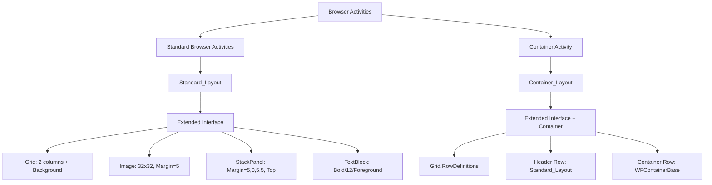

# Design Document: Browser Interface Modernization

## Overview

Данный дизайн описывает модернизацию XAML интерфейсов активностей Browser модуля в Primo Platform для приведения их к единому стандарту Extended Interface. Цель - устранить несоответствия в высоте дизайна, отступах и структуре макета, обеспечив визуальную консистентность всех Browser активностей с использованием фонового цвета, стандартной высоты и единообразного стиля текста.

### Проблема

В настоящее время Browser активности имеют следующие проблемы:
- Непоследовательное значение `d:DesignHeight` (некоторые имеют "450", другие не имеют атрибута)
- Отсутствие фонового цвета Grid Background для визуального выделения
- Непоследовательные значения Margin и VerticalAlignment между активностями
- Отсутствие стандартного цвета текста Foreground="#FF0E0E0E" для заголовков
- Лишние пробелы и переносы строк в Grid.ColumnDefinitions
- Отсутствие единого шаблона для создания новых Browser активностей

### Решение

Применить стандарт Extended Interface ко всем Browser активностям:
- **Установить** единое значение `d:DesignHeight="80"` для всех Browser активностей
- **Добавить** `Margin="0,0,0,5"` к UserControl для визуального разделения
- **Добавить** `Grid Background="{DynamicResource {x:Static SystemColors.ScrollBarBrushKey}}"` для фонового цвета
- **Стандартизировать** структуру макета с использованием Standard_Layout (Grid с 2 колонками)
- **Унифицировать** значения Margin и VerticalAlignment (Image Margin="5", StackPanel Margin="5,0,5,5", VerticalAlignment="Top")
- **Установить** единый цвет текста заголовка: FontWeight="Bold", FontSize="12", Foreground="#FF0E0E0E"
- **Сохранить** специальную Container_Layout структуру для BrowserOpen
- **Очистить** форматирование Grid.ColumnDefinitions от лишних пробелов
- **Создать** шаблон ExtendedInterfaceTemplate.xaml для новых активностей

### Преимущества

- Единообразный визуальный интерфейс для всех Browser активностей
- Визуальное выделение активностей с помощью фонового цвета
- Стандартная высота дизайна для консистентного отображения
- Упрощенная поддержка и модификация кода
- Быстрое создание новых активностей с использованием шаблона
- Соответствие стандарту Extended Interface из спецификации xaml-interface-unification

## Architecture

### Компоненты системы



### Классификация активностей

#### 1. Standard Browser Activities (Standard_Layout)
Активности работающие с браузером в целом, использующие стандартный Extended Interface:
- AlertHandle
- BrowserClose
- BrowserNavigate
- BrowserGetInfo
- BrowserScreenshot
- BrowserExecuteJavaScript
- BrowserWaitFor
- BrowserSwitchTo
- BrowserTabManage
- BrowserWindowManage
- BrowserManageCookies
- BrowserStorageManage
- BrowserGetLogs

#### 2. Container Activity (Container_Layout)
Активность-контейнер с вложенными активностями:
- BrowserOpen (специальная структура с Grid.RowDefinitions)

### Стандарты интерфейсов

#### Extended Interface Standard
Применяется ко всем Browser активностям:
- Grid с Background="{DynamicResource {x:Static SystemColors.ScrollBarBrushKey}}"
- UserControl с d:DesignHeight="80" и Margin="0,0,0,5"
- Двухколоночная структура (Auto + *)
- Image 32x32 с Margin="5" и VerticalAlignment="Center"
- StackPanel с VerticalAlignment="Top" и Margin="5,0,5,5"
- TextBlock заголовок: FontWeight="Bold", FontSize="12", Foreground="#FF0E0E0E"
- TextBlock параметры: FontSize="10", Foreground="Gray"

#### Compact Interface Standard
Определен в спецификации xaml-interface-unification (НЕ применяется к Browser активностям):
- Grid без Background атрибута
- UserControl без d:DesignHeight
- StackPanel с VerticalAlignment="Center" и Margin="5"

## Components and Interfaces

### Standard_Layout Structure (Extended Interface)

Стандартная структура для обычных Browser активностей:

```xaml
<UserControl x:Class="Primo.MIA.[ActivityName]"
             xmlns="http://schemas.microsoft.com/winfx/2006/xaml/presentation"
             xmlns:x="http://schemas.microsoft.com/winfx/2006/xaml"
             xmlns:mc="http://schemas.openxmlformats.org/markup-compatibility/2006" 
             xmlns:d="http://schemas.microsoft.com/expression/blend/2008" 
             xmlns:local="clr-namespace:Primo.MIA"
             mc:Ignorable="d"
             d:DesignHeight="80"
             Margin="0,0,0,5">
    <Grid Background="{DynamicResource {x:Static SystemColors.ScrollBarBrushKey}}">
        <Grid.ColumnDefinitions>
            <ColumnDefinition Width="Auto"/>
            <ColumnDefinition Width="*"/>
        </Grid.ColumnDefinitions>

        <Image Grid.Column="0" 
               Width="32" 
               Height="32" 
               Margin="5"
               VerticalAlignment="Center"
               Source="pack://application:,,,/Primo.MIA;component/images/browser.png"/>

        <StackPanel Grid.Column="1" 
                    VerticalAlignment="Top" 
                    Margin="5,0,5,5">
            <TextBlock FontWeight="Bold" 
                       FontSize="12"
                       Foreground="#FF0E0E0E">
                <Run Text="[Название активности]"/>
            </TextBlock>
            <TextBlock FontSize="10" 
                       Foreground="Gray">
                <Run Text="[Параметр]: "/>
                <Run Text="{Binding Path=Prop_[PropertyName], Mode=OneWay}"/>
            </TextBlock>
        </StackPanel>
    </Grid>
</UserControl>
```

#### Ключевые характеристики Standard_Layout:
- **UserControl**: d:DesignHeight="80", Margin="0,0,0,5"
- **Grid**: Background="{DynamicResource {x:Static SystemColors.ScrollBarBrushKey}}"
- **Grid.ColumnDefinitions**: Одна строка без лишних пробелов
- **Image**: Width="32", Height="32", Margin="5", VerticalAlignment="Center"
- **StackPanel**: VerticalAlignment="Top", Margin="5,0,5,5"
- **TextBlock (заголовок)**: FontWeight="Bold", FontSize="12", Foreground="#FF0E0E0E"
- **TextBlock (параметры)**: FontSize="10", Foreground="Gray"

### Container_Layout Structure (BrowserOpen)

Специальная структура для активности-контейнера BrowserOpen:

```xaml
<UserControl x:Class="Primo.MIA.BrowserOpen"
             xmlns="http://schemas.microsoft.com/winfx/2006/xaml/presentation"
             xmlns:x="http://schemas.microsoft.com/winfx/2006/xaml"
             xmlns:mc="http://schemas.openxmlformats.org/markup-compatibility/2006"
             xmlns:d="http://schemas.microsoft.com/expression/blend/2008"
             xmlns:local="clr-namespace:Primo.MIA"
             xmlns:WFItems="clr-namespace:LTools.Common.WFItems;assembly=LTools.Common"
             xmlns:ui="clr-namespace:LTools.Common.UIElements;assembly=LTools.Common"
             mc:Ignorable="d"
             d:DesignHeight="80"
             Margin="0,0,0,5">
    <Grid>
        <Grid.RowDefinitions>
            <RowDefinition Height="Auto"/>
            <RowDefinition Height="*"/>
        </Grid.RowDefinitions>

        <!-- Заголовок с Standard_Layout -->
        <Grid Grid.Row="0" Background="{DynamicResource {x:Static SystemColors.ScrollBarBrushKey}}">
            <Grid.ColumnDefinitions>
                <ColumnDefinition Width="Auto"/>
                <ColumnDefinition Width="*"/>
            </Grid.ColumnDefinitions>

            <Image Grid.Column="0"
                   Width="32"
                   Height="32"
                   Margin="5"
                   VerticalAlignment="Center"
                   Source="pack://application:,,,/Primo.MIA;component/images/browser.png"/>

            <StackPanel Grid.Column="1"
                        VerticalAlignment="Top"
                        Margin="5,0,5,5">
                <TextBlock FontWeight="Bold"
                           FontSize="12"
                           Foreground="#FF0E0E0E">
                    <Run Text="Открыть браузер"/>
                </TextBlock>
                <TextBlock FontSize="10"
                           Foreground="Gray">
                    <Run Text="Тип: "/>
                    <Run Text="{Binding Path=Prop_BrowserType, Mode=OneWay}"/>
                    <Run Text=" | Headless: "/>
                    <Run Text="{Binding Path=Prop_Headless, Mode=OneWay}"/>
                </TextBlock>
            </StackPanel>
        </Grid>

        <!-- Контейнер вложенных активностей -->
        <Grid Grid.Row="1" Margin="5">
            <Border BorderThickness="1"
                    BorderBrush="#CCCCCC"
                    CornerRadius="0"
                    Padding="{x:Static ui:WFElementBase.ContainerPadding}">
                <WFItems:WFContainerBase x:Name="cntBrowser"/>
            </Border>
        </Grid>
    </Grid>
</UserControl>
```

#### Ключевые характеристики Container_Layout:
- **UserControl**: d:DesignHeight="80", Margin="0,0,0,5"
- **Grid**: С Grid.RowDefinitions (Auto + *)
- **Grid.Row="0"**: Заголовок с Standard_Layout структурой + Background
- **Grid.Row="1"**: Контейнер с WFContainerBase для вложенных активностей
- **Заголовок**: Использует те же стандарты Margin, VerticalAlignment и Foreground

### Изменения по активностям

#### Изменения для Standard Browser Activities

Для всех стандартных Browser активностей применяются следующие изменения:

1. **Установка d:DesignHeight и Margin**:
   ```xaml
   <!-- ДО -->
   <UserControl ... d:DesignHeight="450" d:DesignWidth="800">
   
   <!-- ПОСЛЕ -->
   <UserControl ... mc:Ignorable="d" d:DesignHeight="80" Margin="0,0,0,5">
   ```

2. **Добавление Grid Background**:
   ```xaml
   <!-- ДО -->
   <Grid>
   
   <!-- ПОСЛЕ -->
   <Grid Background="{DynamicResource {x:Static SystemColors.ScrollBarBrushKey}}">
   ```

3. **Очистка Grid.ColumnDefinitions**:
   ```xaml
   <!-- ДО (с лишними пробелами) -->
   <Grid.ColumnDefinitions>
   
            <ColumnDefinition Width="Auto"/>
            
            <ColumnDefinition Width="*"/>
            
        </Grid.ColumnDefinitions>
   
   <!-- ПОСЛЕ -->
   <Grid.ColumnDefinitions>
            <ColumnDefinition Width="Auto"/>
            <ColumnDefinition Width="*"/>
        </Grid.ColumnDefinitions>
   ```

4. **Стандартизация атрибутов**:
   - Image: Margin="5", VerticalAlignment="Center"
   - StackPanel: Margin="5,0,5,5", VerticalAlignment="Top"
   - TextBlock заголовок: FontWeight="Bold", FontSize="12", Foreground="#FF0E0E0E"
   - TextBlock параметры: FontSize="10", Foreground="Gray"

#### Изменения для BrowserOpen

Для BrowserOpen применяются те же изменения, но с сохранением Container_Layout:

1. **Установка d:DesignHeight и Margin** в UserControl
2. **Добавление Background** в Grid.Row="0" (заголовок)
3. **Стандартизация заголовка** с теми же Margin, VerticalAlignment и Foreground
4. **Сохранение контейнера** (Grid.Row="1") без изменений

## Data Models

### XAML File Mapping

| Activity | Current State | Target State | Changes |
|----------|--------------|--------------|---------|
| AlertHandle | d:DesignHeight="450" | d:DesignHeight="80" + Extended | Add Background, Margin, Foreground |
| BrowserClose | d:DesignHeight="450" | d:DesignHeight="80" + Extended | Add Background, Margin, Foreground |
| BrowserNavigate | d:DesignHeight="450" | d:DesignHeight="80" + Extended | Add Background, Margin, Foreground |
| BrowserGetInfo | d:DesignHeight="450" | d:DesignHeight="80" + Extended | Add Background, Margin, Foreground |
| BrowserScreenshot | d:DesignHeight="450" | d:DesignHeight="80" + Extended | Add Background, Margin, Foreground |
| BrowserExecuteJavaScript | d:DesignHeight="450" | d:DesignHeight="80" + Extended | Add Background, Margin, Foreground |
| BrowserWaitFor | d:DesignHeight="450" | d:DesignHeight="80" + Extended | Add Background, Margin, Foreground |
| BrowserSwitchTo | d:DesignHeight="450" | d:DesignHeight="80" + Extended | Add Background, Margin, Foreground |
| BrowserTabManage | d:DesignHeight="450" | d:DesignHeight="80" + Extended | Add Background, Margin, Foreground |
| BrowserWindowManage | d:DesignHeight="450" | d:DesignHeight="80" + Extended | Add Background, Margin, Foreground |
| BrowserManageCookies | d:DesignHeight="450" | d:DesignHeight="80" + Extended | Add Background, Margin, Foreground |
| BrowserStorageManage | d:DesignHeight="450" | d:DesignHeight="80" + Extended | Add Background, Margin, Foreground |
| BrowserGetLogs | d:DesignHeight="450" | d:DesignHeight="80" + Extended | Add Background, Margin, Foreground |
| BrowserOpen | d:DesignHeight="450" | d:DesignHeight="80" + Extended | Add Background, Margin, Foreground + Container_Layout |

### Attribute Standards

#### Standard_Layout Attributes

| Element | Attribute | Value | Purpose |
|---------|-----------|-------|---------|
| UserControl | d:DesignHeight | 80 | Стандартная высота дизайна |
| UserControl | Margin | 0,0,0,5 | Визуальное разделение активностей |
| Grid | Background | {DynamicResource {x:Static SystemColors.ScrollBarBrushKey}} | Фоновый цвет для выделения |
| Grid.ColumnDefinitions | - | Auto, * | Двухколоночная структура |
| Image | Width | 32 | Стандартный размер иконки |
| Image | Height | 32 | Стандартный размер иконки |
| Image | Margin | 5 | Консистентный отступ |
| Image | VerticalAlignment | Center | Вертикальное выравнивание |
| StackPanel | Margin | 5,0,5,5 | Консистентный отступ |
| StackPanel | VerticalAlignment | Top | Вертикальное выравнивание |
| TextBlock (title) | FontWeight | Bold | Выделение заголовка |
| TextBlock (title) | FontSize | 12 | Стандартный размер заголовка |
| TextBlock (title) | Foreground | #FF0E0E0E | Стандартный цвет текста |
| TextBlock (params) | FontSize | 10 | Стандартный размер параметров |
| TextBlock (params) | Foreground | Gray | Визуальное отличие параметров |

#### Container_Layout Attributes

| Element | Attribute | Value | Purpose |
|---------|-----------|-------|---------|
| Grid.RowDefinitions | - | Auto, * | Заголовок + контейнер |
| Grid.Row="0" | - | Standard_Layout | Заголовок активности |
| Grid.Row="1" | - | WFContainerBase | Контейнер вложенных активностей |

### Template Structure

Шаблон ExtendedInterfaceTemplate.xaml будет содержать:

```xaml
<UserControl x:Class="Primo.MIA.[ACTIVITY_CLASS_NAME]"
             xmlns="http://schemas.microsoft.com/winfx/2006/xaml/presentation"
             xmlns:x="http://schemas.microsoft.com/winfx/2006/xaml"
             xmlns:mc="http://schemas.openxmlformats.org/markup-compatibility/2006" 
             xmlns:d="http://schemas.microsoft.com/expression/blend/2008" 
             xmlns:local="clr-namespace:Primo.MIA"
             mc:Ignorable="d"
             d:DesignHeight="80"
             Margin="0,0,0,5">
    <!-- 
        EXTENDED INTERFACE TEMPLATE для Browser активностей
        
        ИНСТРУКЦИИ ПО ИСПОЛЬЗОВАНИЮ:
        1. Замените [ACTIVITY_CLASS_NAME] на имя класса активности (например, BrowserNavigate)
        2. Замените [ICON_PATH] на путь к иконке (обычно: pack://application:,,,/Primo.MIA;component/images/browser.png)
        3. Замените [ACTIVITY_TITLE] на название активности (например, "Навигация браузера")
        4. Замените [PARAMETER_LABEL] на метку параметра (например, "URL")
        5. Замените [PROPERTY_NAME] на имя свойства для привязки (например, Prop_Url)
        
        ПРИМЕРЫ:
        
        Простой заголовок без параметров:
        <TextBlock FontWeight="Bold" FontSize="12" Foreground="#FF0E0E0E">
            <Run Text="Закрыть браузер"/>
        </TextBlock>
        
        Заголовок с одним параметром:
        <TextBlock FontSize="10" Foreground="Gray">
            <Run Text="URL: "/>
            <Run Text="{Binding Path=Prop_Url, Mode=OneWay}"/>
        </TextBlock>
        
        Заголовок с несколькими параметрами:
        <TextBlock FontSize="10" Foreground="Gray">
            <Run Text="Тип: "/>
            <Run Text="{Binding Path=Prop_BrowserType, Mode=OneWay}"/>
            <Run Text=" | Headless: "/>
            <Run Text="{Binding Path=Prop_Headless, Mode=OneWay}"/>
        </TextBlock>
    -->
    <Grid Background="{DynamicResource {x:Static SystemColors.ScrollBarBrushKey}}">
        <Grid.ColumnDefinitions>
            <ColumnDefinition Width="Auto"/>
            <ColumnDefinition Width="*"/>
        </Grid.ColumnDefinitions>

        <Image Grid.Column="0" 
               Width="32" 
               Height="32" 
               Margin="5"
               VerticalAlignment="Center"
               Source="[ICON_PATH]"/>

        <StackPanel Grid.Column="1" 
                    VerticalAlignment="Top" 
                    Margin="5,0,5,5">
            <TextBlock FontWeight="Bold" 
                       FontSize="12"
                       Foreground="#FF0E0E0E">
                <Run Text="[ACTIVITY_TITLE]"/>
            </TextBlock>
            <TextBlock FontSize="10" 
                       Foreground="Gray">
                <Run Text="[PARAMETER_LABEL]: "/>
                <Run Text="{Binding Path=Prop_[PROPERTY_NAME], Mode=OneWay}"/>
            </TextBlock>
        </StackPanel>
    </Grid>
</UserControl>
```

Плейсхолдеры для замены:
- `[ACTIVITY_CLASS_NAME]` - имя класса активности
- `[ICON_PATH]` - путь к иконке активности
- `[ACTIVITY_TITLE]` - название активности на русском
- `[PARAMETER_LABEL]` - метка параметра
- `[PROPERTY_NAME]` - имя свойства для привязки данных

