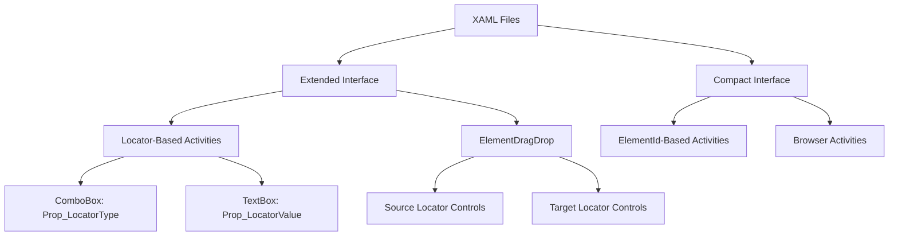

# Design Document: XAML Interface Unification

## Overview

Данный дизайн описывает унификацию XAML интерфейсов активностей Browser модуля в Primo Platform. Цель - применить расширенный интерфейс с элементами управления для настройки локаторов ко всем Element активностям, которые работают с поиском элементов на веб-странице.

### Проблема

В настоящее время активности Browser модуля имеют разнородные XAML интерфейсы:
- Некоторые активности (например, ElementClick) используют расширенный интерфейс с ComboBox для выбора типа локатора и TextBox для ввода значения
- Другие активности (например, ElementExists) используют компактный интерфейс, показывающий только иконку и текстовое описание
- Это создает непоследовательный пользовательский опыт и затрудняет настройку активностей

### Решение

Унифицировать XAML интерфейсы на основе типа активности:
- **Locator-Based Activities** (активности с Prop_LocatorType и Prop_LocatorValue) → расширенный интерфейс
- **ElementId-Based Activities** (активности с Prop_ElementId) → компактный интерфейс
- **Browser Activities** (активности работающие с браузером в целом) → компактный интерфейс
- **ElementDragDrop** (специальный случай с двумя локаторами) → расширенный интерфейс с двумя наборами элементов управления

### Преимущества

- Единообразный пользовательский опыт
- Быстрая настройка локаторов без открытия окна свойств
- Визуальная консистентность интерфейса
- Упрощенная поддержка и модификация кода

## Architecture

### Компоненты системы



### Классификация активностей

#### 1. Locator-Based Activities (Расширенный интерфейс)
Активности с одним локатором (Prop_LocatorType + Prop_LocatorValue):
- ElementExists
- ElementIsVisible
- ElementSelect
- ElementSelectMultiple
- ElementGetComputedStyle
- ElementGetProperty
- ElementGetRect
- ElementGetScreenshot
- ElementSubmit
- ElementUploadFile
- ElementFind
- ElementWaitAndCheck

#### 2. ElementId-Based Activities (Компактный интерфейс)
Активности использующие Prop_ElementId вместо локаторов:
- ElementHover
- ElementInput
- ElementScrollTo

#### 3. Browser Activities (Компактный интерфейс)
Активности работающие с браузером в целом:
- BrowserOpen
- BrowserClose
- BrowserNavigate
- BrowserGetInfo
- BrowserScreenshot
- BrowserExecuteJavaScript
- BrowserWaitFor
- BrowserSwitchTo
- BrowserTabManage
- BrowserWindowManage
- BrowserManageCookies
- BrowserStorageManage
- BrowserGetLogs
- AlertHandle

#### 4. Special Case: ElementDragDrop
Активность с двумя локаторами (исходный и целевой):
- Prop_SourceLocatorType + Prop_SourceLocatorValue
- Prop_TargetLocatorType + Prop_TargetLocatorValue

## Components and Interfaces

### Extended Interface Structure

Расширенный интерфейс используется для Locator-Based Activities и состоит из следующих компонентов:

```xaml
<UserControl d:DesignHeight="80" Margin="0,0,0,5">
    <UserControl.Resources>
        <ObjectDataProvider x:Key="LocatorTypeValues" 
                            MethodName="GetValues" 
                            ObjectType="{x:Type system:Enum}">
            <ObjectDataProvider.MethodParameters>
                <x:Type TypeName="local:ElementLocatorType"/>
            </ObjectDataProvider.MethodParameters>
        </ObjectDataProvider>
    </UserControl.Resources>
    
    <Grid Background="{DynamicResource {x:Static SystemColors.ScrollBarBrushKey}}">
        <Grid.ColumnDefinitions>
            <ColumnDefinition Width="Auto"/>
            <ColumnDefinition Width="*"/>
        </Grid.ColumnDefinitions>
        
        <Image Grid.Column="0" Width="32" Height="32" Margin="5" 
               VerticalAlignment="Center" Source="..."/>
        
        <StackPanel Grid.Column="1" VerticalAlignment="Top" Margin="5,0,5,5">
            <TextBlock FontWeight="Bold" FontSize="12">
                [Название активности]
            </TextBlock>
            
            <ComboBox ItemsSource="{Binding Source={StaticResource LocatorTypeValues}}"
                      SelectedItem="{Binding Prop_LocatorType}"
                      Margin="0,2,6,2" Height="22"/>
            
            <TextBox Text="{Binding Prop_LocatorValue}"
                     Margin="0,2,6,0" Height="22"/>
        </StackPanel>
    </Grid>
</UserControl>
```

#### Ключевые характеристики:
- **UserControl**: d:DesignHeight="80", Margin="0,0,0,5"
- **Grid**: Background с системным цветом ScrollBar
- **Layout**: Двухколоночная структура (Auto + *)
- **Image**: 32x32 пикселя, Margin="5", VerticalAlignment="Center"
- **StackPanel**: VerticalAlignment="Top", Margin="5,0,5,5"
- **ComboBox**: Height="22", Margin="0,2,6,2"
- **TextBox**: Height="22", Margin="0,2,6,0"

### Compact Interface Structure

Компактный интерфейс используется для ElementId-Based и Browser Activities:

```xaml
<UserControl>
    <Grid>
        <Grid.ColumnDefinitions>
            <ColumnDefinition Width="Auto"/>
            <ColumnDefinition Width="*"/>
        </Grid.ColumnDefinitions>
        
        <Image Grid.Column="0" Width="32" Height="32" Margin="5"
               VerticalAlignment="Center" Source="..."/>
        
        <StackPanel Grid.Column="1" VerticalAlignment="Center" Margin="5">
            <TextBlock Text="[Название активности]" 
                       FontWeight="Bold" FontSize="12"/>
            <TextBlock FontSize="10" Foreground="Gray">
                <Run Text="[Параметр]: "/>
                <Run Text="{Binding Path=Prop_[Parameter], Mode=OneWay}"/>
            </TextBlock>
        </StackPanel>
    </Grid>
</UserControl>
```

#### Ключевые характеристики:
- **Grid**: Без Background
- **StackPanel**: VerticalAlignment="Center", Margin="5"
- **TextBlock (заголовок)**: FontWeight="Bold", FontSize="12"
- **TextBlock (параметр)**: FontSize="10", Foreground="Gray"

### ElementDragDrop Special Interface

Специальный интерфейс для ElementDragDrop с двумя наборами локаторов:

```xaml
<UserControl d:DesignHeight="120" Margin="0,0,0,5">
    <UserControl.Resources>
        <ObjectDataProvider x:Key="LocatorTypeValues" .../>
    </UserControl.Resources>
    
    <Grid Background="{DynamicResource {x:Static SystemColors.ScrollBarBrushKey}}">
        <Grid.ColumnDefinitions>
            <ColumnDefinition Width="Auto"/>
            <ColumnDefinition Width="*"/>
        </Grid.ColumnDefinitions>
        
        <Image Grid.Column="0" .../>
        
        <StackPanel Grid.Column="1" VerticalAlignment="Top" Margin="5,0,5,5">
            <TextBlock FontWeight="Bold" FontSize="12">
                Перетаскивание элемента
            </TextBlock>
            
            <!-- Исходный элемент -->
            <TextBlock Text="Исходный элемент" Margin="0,5,0,2"/>
            <ComboBox SelectedItem="{Binding Prop_SourceLocatorType}" .../>
            <TextBox Text="{Binding Prop_SourceLocatorValue}" .../>
            
            <!-- Целевой элемент -->
            <TextBlock Text="Целевой элемент" Margin="0,5,0,2"/>
            <ComboBox SelectedItem="{Binding Prop_TargetLocatorType}" .../>
            <TextBox Text="{Binding Prop_TargetLocatorValue}" .../>
        </StackPanel>
    </Grid>
</UserControl>
```

## Data Models

### ElementLocatorType Enum

```csharp
public enum ElementLocatorType
{
    Id,
    Name,
    ClassName,
    TagName,
    LinkText,
    PartialLinkText,
    CssSelector,
    XPath
}
```

Этот enum используется в ObjectDataProvider для заполнения ComboBox в расширенном интерфейсе.

### Activity Property Bindings

#### Locator-Based Activity Properties
```csharp
public ElementLocatorType Prop_LocatorType { get; set; }
public string Prop_LocatorValue { get; set; }
```

#### ElementDragDrop Properties
```csharp
// Исходный элемент
public ElementLocatorType Prop_SourceLocatorType { get; set; }
public string Prop_SourceLocatorValue { get; set; }

// Целевой элемент
public ElementLocatorType Prop_TargetLocatorType { get; set; }
public string Prop_TargetLocatorValue { get; set; }
```

#### ElementId-Based Activity Properties
```csharp
public string Prop_ElementId { get; set; }
```

### XAML File Mapping

| Activity | Current Interface | Target Interface | Properties |
|----------|------------------|------------------|------------|
| ElementExists | Compact | Extended | Prop_LocatorType, Prop_LocatorValue |
| ElementIsVisible | Compact | Extended | Prop_LocatorType, Prop_LocatorValue |
| ElementSelect | Compact | Extended | Prop_LocatorType, Prop_LocatorValue |
| ElementSelectMultiple | Compact | Extended | Prop_LocatorType, Prop_LocatorValue |
| ElementGetComputedStyle | Compact | Extended | Prop_LocatorType, Prop_LocatorValue |
| ElementGetProperty | Compact | Extended | Prop_LocatorType, Prop_LocatorValue |
| ElementGetRect | Compact | Extended | Prop_LocatorType, Prop_LocatorValue |
| ElementGetScreenshot | Compact | Extended | Prop_LocatorType, Prop_LocatorValue |
| ElementSubmit | Compact | Extended | Prop_LocatorType, Prop_LocatorValue |
| ElementUploadFile | Compact | Extended | Prop_LocatorType, Prop_LocatorValue |
| ElementFind | Compact | Extended | Prop_LocatorType, Prop_LocatorValue |
| ElementWaitAndCheck | Compact | Extended | Prop_LocatorType, Prop_LocatorValue |
| ElementDragDrop | Compact | Extended (Special) | Source/Target Locators |
| ElementHover | Compact | Compact (No change) | Prop_ElementId |
| ElementInput | Compact | Compact (No change) | Prop_ElementId |
| ElementScrollTo | Compact | Compact (No change) | Prop_ElementId |
| ElementClick | Extended | Extended (No change) | Prop_LocatorType, Prop_LocatorValue |


## Correctness Properties

*A property is a characteristic or behavior that should hold true across all valid executions of a system-essentially, a formal statement about what the system should do. Properties serve as the bridge between human-readable specifications and machine-verifiable correctness guarantees.*

### Property 1: Extended Interface Structure Completeness

*For any* XAML file implementing Extended Interface, the file SHALL contain all required structural elements: ObjectDataProvider for ElementLocatorType enum, ComboBox bound to Prop_LocatorType, TextBox bound to Prop_LocatorValue, Grid with two columns (Auto, *), Image in Grid.Column="0" with dimensions 32x32, StackPanel in Grid.Column="1", and TextBlock header with FontWeight="Bold" and FontSize="12".

**Validates: Requirements 1.1, 1.2, 1.6, 1.7, 5.1, 5.2, 5.3**

### Property 2: Extended Interface Attribute Consistency

*For any* XAML file implementing Extended Interface, all layout attributes SHALL match the specification: UserControl with d:DesignHeight="80" and Margin="0,0,0,5", Grid with Background="{DynamicResource {x:Static SystemColors.ScrollBarBrushKey}}", StackPanel with VerticalAlignment="Top" and Margin="5,0,5,5", Image with Margin="5", ComboBox with Height="22" and Margin="0,2,6,2", TextBox with Height="22" and Margin="0,2,6,0".

**Validates: Requirements 1.3, 1.4, 1.8, 5.4, 5.5, 5.6, 5.7, 5.8, 5.9**

### Property 3: Compact Interface Structure Completeness

*For any* XAML file implementing Compact Interface, the file SHALL contain required structural elements: Grid with two columns (Auto, *), Image in Grid.Column="0" with dimensions 32x32, StackPanel in Grid.Column="1" with VerticalAlignment="Center", TextBlock header with FontWeight="Bold" and FontSize="12", and TextBlock parameter display with FontSize="10" and Foreground="Gray".

**Validates: Requirements 4.3, 4.5, 4.6**

### Property 4: Compact Interface Attribute Consistency

*For any* XAML file implementing Compact Interface, the Grid element SHALL NOT have a Background attribute set.

**Validates: Requirements 4.4**

### Property 5: Locator-Based Activities Interface Mapping

*For any* activity with properties Prop_LocatorType and Prop_LocatorValue (Locator-Based Activity), the corresponding XAML file SHALL implement Extended Interface structure.

**Validates: Requirements 1.5, 2.3**

### Property 6: ElementId-Based Activities Interface Mapping

*For any* activity with property Prop_ElementId but without Prop_LocatorType and Prop_LocatorValue (ElementId-Based Activity), the corresponding XAML file SHALL implement Compact Interface structure.

**Validates: Requirements 2.4, 4.2**

### Property 7: Browser Activities Interface Mapping

*For any* Browser activity (activities working with browser as a whole, not specific elements), the corresponding XAML file SHALL implement Compact Interface structure.

**Validates: Requirements 2.5, 4.1**

### Property 8: ElementDragDrop Dual Locator Structure

*For* ElementDragDrop activity XAML file, the file SHALL contain two complete sets of locator controls: first set with ComboBox bound to Prop_SourceLocatorType and TextBox bound to Prop_SourceLocatorValue, second set with ComboBox bound to Prop_TargetLocatorType and TextBox bound to Prop_TargetLocatorValue, with TextBlock labels "Исходный элемент" and "Целевой элемент" respectively.

**Validates: Requirements 3.1, 3.3, 3.4, 3.6, 3.7**

### Property 9: XAML Binding Validity

*For any* XAML file with data bindings, all Binding expressions SHALL reference properties that exist in the corresponding Back.cs file with matching names and compatible types.

**Validates: Requirements 6.5, 6.6**

## Error Handling

### XAML Parsing Errors

**Scenario**: XAML файл содержит синтаксические ошибки
- **Detection**: Ошибки компиляции при сборке проекта
- **Handling**: Компилятор WPF выдаст детальное сообщение об ошибке с указанием строки и позиции
- **Prevention**: Использование XAML валидатора в IDE, проверка структуры перед коммитом

### Missing Property Bindings

**Scenario**: XAML содержит привязку к несуществующему свойству
- **Detection**: Runtime ошибка при загрузке UserControl или отсутствие данных в UI
- **Handling**: WPF выдаст предупреждение в Output window, но не упадет
- **Prevention**: Автоматическая проверка соответствия привязок и свойств через Property 9

### Incorrect Enum Values

**Scenario**: ObjectDataProvider ссылается на несуществующий enum
- **Detection**: Ошибка компиляции или runtime ошибка
- **Handling**: Компилятор или WPF выдаст сообщение об ошибке
- **Prevention**: Использование правильного namespace и имени enum (local:ElementLocatorType)

### Layout Issues

**Scenario**: Неправильные значения Margin или Height приводят к некорректному отображению
- **Detection**: Визуальная проверка в дизайнере
- **Handling**: Корректировка значений атрибутов
- **Prevention**: Использование стандартных значений из спецификации, автоматическая проверка через Properties 2 и 4

## Testing Strategy

### Dual Testing Approach

Для обеспечения корректности унификации XAML интерфейсов будет использоваться комбинация unit тестов и property-based тестов:

- **Unit tests**: Проверка конкретных XAML файлов на соответствие спецификации
- **Property tests**: Проверка универсальных свойств для всех XAML файлов соответствующего типа

### Unit Testing

Unit тесты будут фокусироваться на:

1. **Конкретные примеры**: Проверка ElementClick.xaml как эталона Extended Interface
2. **Конкретные примеры**: Проверка AlertHandle.xaml как эталона Compact Interface
3. **Специальный случай**: Проверка ElementDragDrop.xaml на наличие двух наборов локаторов
4. **Edge cases**: Проверка активностей на границе категорий (например, ElementClick уже имеет Extended Interface)

### Property-Based Testing

Property-based тесты будут использовать библиотеку **FsCheck** для C#/.NET и проверять:

**Property 1-4**: Структурная валидация XAML
- Генерация: Список всех XAML файлов в папке Browser/
- Проверка: Парсинг XML и валидация структуры согласно типу интерфейса
- Iterations: 100+ (по количеству XAML файлов)

**Property 5-7**: Соответствие активностей и интерфейсов
- Генерация: Пары (Back.cs файл, XAML файл) для всех активностей
- Проверка: Анализ свойств в Back.cs и структуры XAML
- Iterations: 100+ (по количеству активностей)

**Property 8**: ElementDragDrop специальная структура
- Проверка: Парсинг ElementDragDrop.xaml и валидация двух наборов локаторов
- Iterations: 1 (специфичный файл)

**Property 9**: Валидация привязок
- Генерация: Все пары (XAML файл, Back.cs файл)
- Проверка: Извлечение всех Binding выражений из XAML и проверка существования свойств в Back.cs
- Iterations: 100+ (по количеству файлов)

### Test Configuration

Каждый property-based тест будет:
- Запускаться минимум 100 раз (или по количеству файлов, если больше)
- Помечен комментарием: `// Feature: xaml-interface-unification, Property {N}: {description}`
- Использовать FsCheck для генерации тестовых данных
- Выводить детальную информацию при ошибке (имя файла, ожидаемое значение, фактическое значение)

### Testing Tools

- **XAML Parser**: System.Xml.Linq для парсинга XAML файлов
- **Reflection**: System.Reflection для анализа свойств в Back.cs файлах
- **Property Testing**: FsCheck для property-based тестирования
- **Unit Testing**: xUnit или NUnit для unit тестов

### Test Data

Тестовые данные будут включать:

1. **Списки активностей по категориям**:
   - Locator-Based: ElementExists, ElementIsVisible, ElementSelect, ElementSelectMultiple, ElementGetComputedStyle, ElementGetProperty, ElementGetRect, ElementGetScreenshot, ElementSubmit, ElementUploadFile, ElementFind, ElementWaitAndCheck
   - ElementId-Based: ElementHover, ElementInput, ElementScrollTo
   - Browser: BrowserOpen, BrowserClose, BrowserNavigate, BrowserGetInfo, BrowserScreenshot, BrowserExecuteJavaScript, BrowserWaitFor, BrowserSwitchTo, BrowserTabManage, BrowserWindowManage, BrowserManageCookies, BrowserStorageManage, BrowserGetLogs, AlertHandle

2. **Эталонные XAML структуры**:
   - Extended Interface template
   - Compact Interface template
   - ElementDragDrop special template

3. **Ожидаемые атрибуты**:
   - Extended Interface: все атрибуты из Property 2
   - Compact Interface: все атрибуты из Property 4

### Manual Testing

После автоматического тестирования потребуется ручная проверка:

1. **Визуальная проверка**: Открытие каждого измененного XAML файла в дизайнере Primo Platform
2. **Функциональная проверка**: Создание тестового процесса с использованием измененных активностей
3. **Компиляция**: Полная сборка проекта без ошибок
4. **Regression testing**: Проверка что существующие процессы продолжают работать

