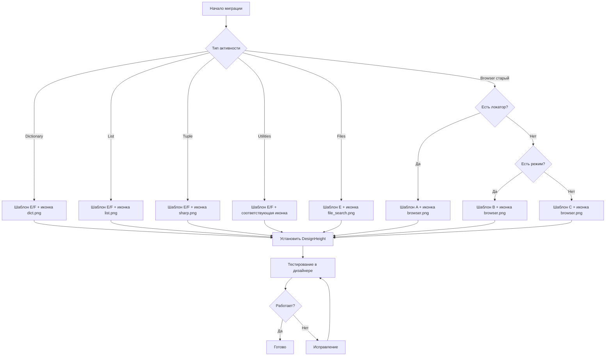

# План миграции активностей на новый UI-дизайн

> **Примечание:** BrowserOpen — эталонный шаблон для контейнерных активностей (шаблон D). Не требует миграции.

## 1. Анализ текущего состояния

### 1.1 Выявленные стили UI

В проекте обнаружены **4 различных стиля** UI-дизайна активностей:

| Стиль | Примеры | Характеристики |
|-------|---------|----------------|
| **Новый** | ElementClick, ElementInput, BrowserNavigate, Http | Иконка + заголовок с режимом [Mode] + поля ввода |
| **Старый** | ElementHover, ElementGetInfo | Иконка + простой заголовок + мелкий текст режима |
| **Минимальный** | DictionaryCreate, ListFilter, TupleCreate, Generators | Только TextBox без иконки и заголовка |
| **Контейнерный** | BrowserOpen | Label + ComboBox + WFContainerBase |

### 1.2 Статистика активностей по категориям

| Категория | Всего | Новый стиль | Старый стиль | Минимальный | Контейнерный |
|-----------|-------|-------------|--------------|-------------|--------------|
| **Browser** | 35 | 32 | 2 | 0 | 1 (эталон) |
| **Dictionary** | 12 | 0 | 0 | 12 | 0 |
| **List** | 9 | 0 | 0 | 9 | 0 |
| **Tuple** | 10 | 0 | 0 | 10 | 0 |
| **Files** | 2 | 0 | 0 | 2 | 0 |
| **HttpWeb** | 1 | 1 | 0 | 0 | 0 |
| **Utilities** | 5 | 0 | 0 | 5 | 0 |
| **Итого** | **74** | **33** | **2** | **38** | **1** |

### 1.3 Детальный список активностей

#### Browser (35 активностей)

**Новый стиль (32) — миграция не требуется:**
- AlertHandle, BrowserClose, BrowserExecuteJavaScript, BrowserGetInfo, BrowserGetLogs
- BrowserManageCookies, BrowserNavigate, BrowserScreenshot, BrowserStorageManage
- BrowserSwitchTo, BrowserTabManage, BrowserWaitFor, BrowserWindowManage
- ElementClick, ElementDragDrop, ElementExists, ElementFind, ElementGetComputedStyle
- ElementGetProperty, ElementGetRect, ElementGetScreenshot, ElementInput
- ElementIsVisible, ElementScrollTo, ElementSearch, ElementSelect, ElementSelectMultiple
- ElementSubmit, ElementUploadFile, ElementWaitAndCheck

**Старый стиль (2) — требуется миграция:**
- ElementGetInfo — старый стиль с мелким текстом режима
- ElementHover — старый стиль без режима

**Контейнерный (1) — эталонный шаблон D:**
- BrowserOpen — **не мигрируется**, является эталоном для контейнерных активностей

#### Dictionary (12 активностей) — все требуют миграции

| Активность | Текущий UI | Иконка |
|------------|------------|--------|
| DictionaryContainsKey | Минимальный | dict.png |
| DictionaryContainsValue | Минимальный | dict.png |
| DictionaryCreate | Минимальный | dict.png |
| DictionaryFilter | Минимальный | dict.png |
| DictionaryFromString | Минимальный | dict.png |
| DictionaryGetInfo | Минимальный | dict.png |
| DictionaryGetValue | Минимальный | dict.png |
| DictionaryMerge | Минимальный | dict.png |
| DictionaryOperationsSmall | Минимальный | dict.png |
| DictionarySetValue | Минимальный | dict.png |
| DictionaryToString | Минимальный | dict.png |

#### List (9 активностей) — все требуют миграции

| Активность | Текущий UI | Иконка |
|------------|------------|--------|
| ListAggregate | Минимальный | list.png |
| ListConvert | Минимальный | list.png |
| ListFilter | Минимальный | list.png |
| ListGroup | Минимальный | list.png |
| ListInspect | Минимальный | list.png |
| ListSet | Минимальный | list.png |
| ListSlice | Минимальный | list.png |
| ListSort | Минимальный | list.png |
| ListTransform | Минимальный | list.png |

#### Tuple (10 активностей) — все требуют миграции

| Активность | Текущий UI | Иконка |
|------------|------------|--------|
| TupleConvert | Минимальный | sharp.png |
| TupleCreate | Минимальный | sharp.png |
| TupleDestructure | Минимальный | sharp.png |
| TupleGet | Минимальный | sharp.png |
| TupleInspect | Минимальный | sharp.png |
| TupleSet | Минимальный | sharp.png |
| TupleSort | Минимальный | sharp.png |
| TupleUnzip | Минимальный | sharp.png |
| TupleZip | Минимальный | sharp.png |

#### Files (2 активности) — все требуют миграции

| Активность | Текущий UI | Иконка |
|------------|------------|--------|
| SearchFiles | Минимальный | file_search.png |
| WaitForFile | Минимальный | sharp.png |

#### HttpWeb (1 активность)

| Активность | Текущий UI | Иконка |
|------------|------------|--------|
| Http | Новый | http.png |

#### Utilities (5 активностей) — все требуют миграции

| Активность | Текущий UI | Иконка |
|------------|------------|--------|
| ExcelCellRecalculate | Минимальный | excel.png |
| Generators | Минимальный | generator.png |
| LogMessage | Минимальный | log.png |
| ReadTomlConfig | Минимальный | config.png |

---

## 2. Спецификация нового дизайна

### 2.1 Общие принципы

1. **Единообразие** — все активности одного типа имеют идентичную структуру
2. **Информативность** — заголовок отображает название активности и текущий режим
3. **Компактность** — DesignHeight соответствует реальному содержимому
4. **Консистентность** — одинаковые отступы, шрифты, размеры элементов

### 2.2 Цветовая схема

```xml
<!-- Фон -->
Background="{DynamicResource {x:Static SystemColors.ScrollBarBrushKey}}"

<!-- Заголовок -->
FontWeight="Bold" FontSize="12" Foreground="#FF0E0E0E"

<!-- Вторичный текст -->
FontSize="10" Foreground="Gray"

<!-- Границы TextBox -->
BorderThickness="0" BorderBrush="#D0D7E2"
```

### 2.3 Размеры элементов

| Элемент | Размер |
|---------|--------|
| Иконка | 32x32 px |
| ComboBox | Height="22" |
| TextBox | Height="22" |
| Margin иконки | 5px |
| Margin StackPanel | 5,0,5,5 |

### 2.4 Соответствие иконок категориям

| Категория | Иконка | Константа в ActivityIcons |
|-----------|--------|---------------------------|
| Browser | browser.png | ActivityIcons.Browser |
| Dictionary | dict.png | ActivityIcons.Dictionary |
| List | list.png | ActivityIcons.List |
| Tuple | sharp.png | ActivityIcons.Tuple |
| Files (Search) | file_search.png | ActivityIcons.FileSearch |
| Files (Wait) | sharp.png | ActivityIcons.FileWait |
| HttpWeb | http.png | ActivityIcons.Http |
| Utilities (Log) | log.png | ActivityIcons.Log |
| Utilities (Generator) | generator.png | ActivityIcons.Generator |
| Utilities (Config) | config.png | ActivityIcons.Config |
| Utilities (Excel) | excel.png | ActivityIcons.Excel |

---

## 3. Шаблоны UI для типов активностей

### 3.1 Шаблон A: Активность с режимом и локатором (Browser)

Для активностей, работающих с элементами: Click, Input, Find, Select и т.д.

```xml
<UserControl x:Class="Primo.MIA.ИмяАктивности"
             xmlns="http://schemas.microsoft.com/winfx/2006/xaml/presentation"
             xmlns:x="http://schemas.microsoft.com/winfx/2006/xaml"
             xmlns:d="http://schemas.microsoft.com/expression/blend/2008"
             xmlns:mc="http://schemas.openxmlformats.org/markup-compatibility/2006"
             xmlns:system="clr-namespace:System;assembly=mscorlib"
             xmlns:local="clr-namespace:Primo.MIA"
             mc:Ignorable="d"
             d:DesignHeight="80"
             Margin="0,0,0,5">

    <UserControl.Resources>
        <ObjectDataProvider x:Key="LocatorTypeValues"
                            MethodName="GetValues"
                            ObjectType="{x:Type system:Enum}">
            <ObjectDataProvider.MethodParameters>
                <x:Type TypeName="local:ElementLocatorType"/>
            </ObjectDataProvider.MethodParameters>
        </ObjectDataProvider>
    </UserControl.Resources>

    <Grid Background="{DynamicResource {x:Static SystemColors.ScrollBarBrushKey}}">
        <Grid.ColumnDefinitions>
            <ColumnDefinition Width="Auto"/>
            <ColumnDefinition Width="*"/>
        </Grid.ColumnDefinitions>

        <Image Grid.Column="0"
               Width="32" Height="32" Margin="5"
               VerticalAlignment="Center"
               Source="pack://application:,,,/Primo.MIA;component/images/browser.png"/>

        <StackPanel Grid.Column="1"
                    VerticalAlignment="Top"
                    Margin="5,0,5,5">

            <TextBlock FontWeight="Bold" FontSize="12">
                <Run Text="Название активности [" Foreground="#FF0E0E0E"/>
                <Run Text="{Binding Path=Prop_Mode, Mode=OneWay}" Foreground="#FF0E0E0E"/>
                <Run Text="]" Foreground="#FF0E0E0E"/>
            </TextBlock>

            <ComboBox ItemsSource="{Binding Source={StaticResource LocatorTypeValues}}"
                      SelectedItem="{Binding Prop_LocatorType}"
                      Margin="0,2,6,2" Height="22"/>

            <TextBox Text="{Binding Prop_LocatorValue}"
                     BorderThickness="0" TextWrapping="NoWrap"
                     BorderBrush="#D0D7E2"
                     Margin="0,2,6,0" Height="22"/>

        </StackPanel>
    </Grid>
</UserControl>
```

**Высота:** 80px (один локатор) / 120px (два локатора)

### 3.2 Шаблон B: Активность с режимом без локатора

Для активностей без поиска элементов: Alert, Navigate, WaitFor и т.д.

```xml
<UserControl x:Class="Primo.MIA.ИмяАктивности"
             xmlns="http://schemas.microsoft.com/winfx/2006/xaml/presentation"
             xmlns:x="http://schemas.microsoft.com/winfx/2006/xaml"
             xmlns:d="http://schemas.microsoft.com/expression/blend/2008"
             xmlns:mc="http://schemas.openxmlformats.org/markup-compatibility/2006"
             xmlns:system="clr-namespace:System;assembly=mscorlib"
             xmlns:local="clr-namespace:Primo.MIA"
             mc:Ignorable="d"
             d:DesignHeight="50"
             Margin="0,0,0,5">

    <UserControl.Resources>
        <ObjectDataProvider x:Key="ModeValues"
                            MethodName="GetValues"
                            ObjectType="{x:Type system:Enum}">
            <ObjectDataProvider.MethodParameters>
                <x:Type TypeName="local:РежимEnum"/>
            </ObjectDataProvider.MethodParameters>
        </ObjectDataProvider>
    </UserControl.Resources>

    <Grid Background="{DynamicResource {x:Static SystemColors.ScrollBarBrushKey}}">
        <Grid.ColumnDefinitions>
            <ColumnDefinition Width="Auto"/>
            <ColumnDefinition Width="*"/>
        </Grid.ColumnDefinitions>

        <Image Grid.Column="0"
               Width="32" Height="32" Margin="5"
               VerticalAlignment="Center"
               Source="pack://application:,,,/Primo.MIA;component/images/ИКОНКА.png"/>

        <StackPanel Grid.Column="1"
                    VerticalAlignment="Top"
                    Margin="5,0,5,5">

            <TextBlock FontWeight="Bold" FontSize="12">
                <Run Text="Название активности [" Foreground="#FF0E0E0E"/>
                <Run Text="{Binding Path=Prop_Mode, Mode=OneWay}" Foreground="#FF0E0E0E"/>
                <Run Text="]" Foreground="#FF0E0E0E"/>
            </TextBlock>

            <ComboBox ItemsSource="{Binding Source={StaticResource ModeValues}}"
                      SelectedItem="{Binding Prop_Mode}"
                      Margin="0,2,6,2" Height="22"/>

        </StackPanel>
    </Grid>
</UserControl>
```

**Высота:** 50px (режим + ComboBox) / 80px (режим + ComboBox + TextBox)

### 3.3 Шаблон C: Простая активность без режима

Для простых активностей: BrowserClose, BrowserGetInfo и т.д.

```xml
<UserControl x:Class="Primo.MIA.ИмяАктивности"
             xmlns="http://schemas.microsoft.com/winfx/2006/xaml/presentation"
             xmlns:x="http://schemas.microsoft.com/winfx/2006/xaml"
             xmlns:d="http://schemas.microsoft.com/expression/blend/2008"
             xmlns:mc="http://schemas.openxmlformats.org/markup-compatibility/2006"
             xmlns:local="clr-namespace:Primo.MIA"
             mc:Ignorable="d"
             d:DesignHeight="50"
             Margin="0,0,0,5">

    <Grid Background="{DynamicResource {x:Static SystemColors.ScrollBarBrushKey}}">
        <Grid.ColumnDefinitions>
            <ColumnDefinition Width="Auto"/>
            <ColumnDefinition Width="*"/>
        </Grid.ColumnDefinitions>

        <Image Grid.Column="0"
               Width="32" Height="32" Margin="5"
               VerticalAlignment="Center"
               Source="pack://application:,,,/Primo.MIA;component/images/ИКОНКА.png"/>

        <StackPanel Grid.Column="1"
                    VerticalAlignment="Top"
                    Margin="5,0,5,5">

            <TextBlock FontWeight="Bold" FontSize="12" Foreground="#FF0E0E0E">
                <Run Text="Название активности"/>
            </TextBlock>

        </StackPanel>
    </Grid>
</UserControl>
```

**Высота:** 50px

### 3.4 Шаблон D: Активность-контейнер

Для контейнеров: BrowserOpen

```xml
<UserControl x:Class="Primo.MIA.ИмяАктивности"
             xmlns="http://schemas.microsoft.com/winfx/2006/xaml/presentation"
             xmlns:x="http://schemas.microsoft.com/winfx/2006/xaml"
             xmlns:d="http://schemas.microsoft.com/expression/blend/2008"
             xmlns:mc="http://schemas.openxmlformats.org/markup-compatibility/2006"
             xmlns:system="clr-namespace:System;assembly=mscorlib"
             xmlns:local="clr-namespace:Primo.MIA"
             xmlns:WFItems="clr-namespace:LTools.Common.WFItems;assembly=LTools.Common"
             xmlns:ui="clr-namespace:LTools.Common.UIElements;assembly=LTools.Common"
             mc:Ignorable="d"
             d:DesignHeight="450"
             d:DesignWidth="800">

    <UserControl.Resources>
        <ObjectDataProvider x:Key="ModeValues"
                            MethodName="GetValues"
                            ObjectType="{x:Type system:Enum}">
            <ObjectDataProvider.MethodParameters>
                <x:Type TypeName="local:РежимEnum"/>
            </ObjectDataProvider.MethodParameters>
        </ObjectDataProvider>
    </UserControl.Resources>

    <Grid Background="{DynamicResource {x:Static SystemColors.ScrollBarBrushKey}}">
        <Grid.RowDefinitions>
            <RowDefinition Height="Auto"/>
            <RowDefinition Height="Auto"/>
            <RowDefinition Height="*"/>
        </Grid.RowDefinitions>

        <!-- Заголовок с режимом -->
        <TextBlock Grid.Row="0" FontWeight="Bold" FontSize="12" Margin="5,5,5,0">
            <Run Text="Название активности [" Foreground="#FF0E0E0E"/>
            <Run Text="{Binding Path=Prop_Mode, Mode=OneWay}" Foreground="#FF0E0E0E"/>
            <Run Text="]" Foreground="#FF0E0E0E"/>
        </TextBlock>

        <!-- Выбор режима -->
        <ComboBox Grid.Row="1"
                  ItemsSource="{Binding Source={StaticResource ModeValues}}"
                  SelectedItem="{Binding Prop_Mode}"
                  Margin="5,2,5,5" Height="22"/>

        <!-- Контейнер для вложенных активностей -->
        <Grid Grid.Row="2">
            <Border BorderThickness="1"
                    CornerRadius="0"
                    Padding="{x:Static ui:WFElementBase.ContainerPadding}"
                    Background="{DynamicResource {x:Static SystemColors.ControlDarkDarkBrushKey}}"
                    Margin="5">
                <WFItems:WFContainerBase x:Name="cntContainer"/>
            </Border>
        </Grid>
    </Grid>
</UserControl>
```

**Высота:** 450px (контейнер)

### 3.5 Шаблон E: Активность с режимом и TextBox

Для активностей с режимом и одним полем ввода: Dictionary, List, Tuple, Utilities

```xml
<UserControl x:Class="Primo.MIA.ИмяАктивности"
             xmlns="http://schemas.microsoft.com/winfx/2006/xaml/presentation"
             xmlns:x="http://schemas.microsoft.com/winfx/2006/xaml"
             xmlns:d="http://schemas.microsoft.com/expression/blend/2008"
             xmlns:mc="http://schemas.openxmlformats.org/markup-compatibility/2006"
             xmlns:system="clr-namespace:System;assembly=mscorlib"
             xmlns:local="clr-namespace:Primo.MIA"
             mc:Ignorable="d"
             d:DesignHeight="80"
             Margin="0,0,0,5">

    <UserControl.Resources>
        <ObjectDataProvider x:Key="ModeValues"
                            MethodName="GetValues"
                            ObjectType="{x:Type system:Enum}">
            <ObjectDataProvider.MethodParameters>
                <x:Type TypeName="local:РежимEnum"/>
            </ObjectDataProvider.MethodParameters>
        </ObjectDataProvider>
    </UserControl.Resources>

    <Grid Background="{DynamicResource {x:Static SystemColors.ScrollBarBrushKey}}">
        <Grid.ColumnDefinitions>
            <ColumnDefinition Width="Auto"/>
            <ColumnDefinition Width="*"/>
        </Grid.ColumnDefinitions>

        <Image Grid.Column="0"
               Width="32" Height="32" Margin="5"
               VerticalAlignment="Center"
               Source="pack://application:,,,/Primo.MIA;component/images/ИКОНКА.png"/>

        <StackPanel Grid.Column="1"
                    VerticalAlignment="Top"
                    Margin="5,0,5,5">

            <TextBlock FontWeight="Bold" FontSize="12">
                <Run Text="Название: Подназвание [" Foreground="#FF0E0E0E"/>
                <Run Text="{Binding Path=Prop_Mode, Mode=OneWay}" Foreground="#FF0E0E0E"/>
                <Run Text="]" Foreground="#FF0E0E0E"/>
            </TextBlock>

            <ComboBox ItemsSource="{Binding Source={StaticResource ModeValues}}"
                      SelectedItem="{Binding Prop_Mode}"
                      Margin="0,2,6,2" Height="22"/>

            <TextBox Text="{Binding Prop_InputVariable}"
                     BorderThickness="0" TextWrapping="NoWrap"
                     BorderBrush="#D0D7E2"
                     Margin="0,2,6,0" Height="22"/>

        </StackPanel>
    </Grid>
</UserControl>
```

**Высота:** 80px (режим + ComboBox + TextBox) / 50px (режим + ComboBox)

### 3.6 Шаблон F: Активность без режима с TextBox

Для простых активностей с одним полем ввода

```xml
<UserControl x:Class="Primo.MIA.ИмяАктивности"
             xmlns="http://schemas.microsoft.com/winfx/2006/xaml/presentation"
             xmlns:x="http://schemas.microsoft.com/winfx/2006/xaml"
             xmlns:d="http://schemas.microsoft.com/expression/blend/2008"
             xmlns:mc="http://schemas.openxmlformats.org/markup-compatibility/2006"
             xmlns:local="clr-namespace:Primo.MIA"
             mc:Ignorable="d"
             d:DesignHeight="50"
             Margin="0,0,0,5">

    <Grid Background="{DynamicResource {x:Static SystemColors.ScrollBarBrushKey}}">
        <Grid.ColumnDefinitions>
            <ColumnDefinition Width="Auto"/>
            <ColumnDefinition Width="*"/>
        </Grid.ColumnDefinitions>

        <Image Grid.Column="0"
               Width="32" Height="32" Margin="5"
               VerticalAlignment="Center"
               Source="pack://application:,,,/Primo.MIA;component/images/ИКОНКА.png"/>

        <StackPanel Grid.Column="1"
                    VerticalAlignment="Top"
                    Margin="5,0,5,5">

            <TextBlock FontWeight="Bold" FontSize="12" Foreground="#FF0E0E0E">
                <Run Text="Название: Подназвание"/>
            </TextBlock>

            <TextBox Text="{Binding Prop_InputVariable}"
                     BorderThickness="0" TextWrapping="NoWrap"
                     BorderBrush="#D0D7E2"
                     Margin="0,2,6,0" Height="22"/>

        </StackPanel>
    </Grid>
</UserControl>
```

**Высота:** 50px

---

## 4. План миграции

### 4.1 Приоритеты миграции

| Приоритет | Категория | Количество | Причина |
|-----------|-----------|------------|---------|
| 1 | Dictionary | 12 | Полное отсутствие UI |
| 2 | List | 9 | Полное отсутствие UI |
| 3 | Tuple | 10 | Полное отсутствие UI |
| 4 | Utilities | 5 | Полное отсутствие UI |
| 5 | Files | 2 | Полное отсутствие UI |
| 6 | Browser (старый стиль) | 2 | Несоответствие стилю |

> **Примечание:** BrowserOpen (контейнер) — эталонный шаблон D, не мигрируется.

### 4.2 Детальный план миграции

#### Этап 1: Dictionary-активности (12 штук)

| # | Активность | Шаблон | Высота | Режим |
|---|------------|--------|--------|-------|
| 1.1 | DictionaryContainsKey | F | 50px | — |
| 1.2 | DictionaryContainsValue | F | 50px | — |
| 1.3 | DictionaryCreate | E | 80px | DictionaryCreateMode |
| 1.4 | DictionaryFilter | E | 80px | DictionaryFilterMode |
| 1.5 | DictionaryFromString | E | 80px | DictionaryFromStringMode |
| 1.6 | DictionaryGetInfo | F | 50px | — |
| 1.7 | DictionaryGetValue | F | 80px | — |
| 1.8 | DictionaryMerge | F | 80px | — |
| 1.9 | DictionaryOperationsSmall | F | 50px | — |
| 1.10 | DictionarySetValue | F | 80px | — |
| 1.11 | DictionaryToString | F | 50px | — |

#### Этап 2: List-активности (9 штук)

| # | Активность | Шаблон | Высота | Режим |
|---|------------|--------|--------|-------|
| 2.1 | ListAggregate | E | 80px | ListAggregateMode |
| 2.2 | ListConvert | E | 80px | ListConvertMode |
| 2.3 | ListFilter | E | 80px | ListFilterMode |
| 2.4 | ListGroup | E | 80px | ListGroupMode |
| 2.5 | ListInspect | F | 50px | — |
| 2.6 | ListSet | F | 50px | — |
| 2.7 | ListSlice | E | 80px | ListSliceMode |
| 2.8 | ListSort | E | 80px | ListSortMode |
| 2.9 | ListTransform | E | 80px | ListTransformMode |

#### Этап 3: Tuple-активности (10 штук)

| # | Активность | Шаблон | Высота | Режим |
|---|------------|--------|--------|-------|
| 3.1 | TupleConvert | E | 80px | TupleConvertMode |
| 3.2 | TupleCreate | F | 50px | — |
| 3.3 | TupleDestructure | F | 50px | — |
| 3.4 | TupleGet | F | 50px | — |
| 3.5 | TupleInspect | F | 50px | — |
| 3.6 | TupleSet | F | 50px | — |
| 3.7 | TupleSort | E | 80px | TupleSortMode |
| 3.8 | TupleUnzip | F | 50px | — |
| 3.9 | TupleZip | F | 50px | — |

#### Этап 4: Utilities-активности (5 штук)

| # | Активность | Шаблон | Высота | Режим |
|---|------------|--------|--------|-------|
| 4.1 | ExcelCellRecalculate | F | 50px | — |
| 4.2 | Generators | E | 80px | GeneratorMode |
| 4.3 | LogMessage | F | 50px | — |
| 4.4 | ReadTomlConfig | E | 80px | ReadTomlMode |

#### Этап 5: Files-активности (2 штуки)

| # | Активность | Шаблон | Высота | Режим |
|---|------------|--------|--------|-------|
| 5.1 | SearchFiles | E | 80px | SearchFilesMode |
| 5.2 | WaitForFile | E | 80px | WaitForFileMode |

#### Этап 6: Browser-активности старого стиля (2 штуки)

| # | Активность | Шаблон | Высота | Режим |
|---|------------|--------|--------|-------|
| 6.1 | ElementGetInfo | A | 80px | ElementInfoMode |
| 6.2 | ElementHover | A | 80px | — |

---

## 5. Требования к реализации

### 5.1 Обязательные элементы XAML

1. **Иконка** — 32x32px, источник из `pack://application:,,,/Primo.MIA;component/images/`
2. **Заголовок** — жирный, 12px, с режимом в квадратных скобках (если есть режим)
3. **Фон** — `{DynamicResource {x:Static SystemColors.ScrollBarBrushKey}}`
4. **Margin** — `0,0,0,5` для UserControl
5. **DesignHeight** — соответствует реальному содержимому (50/80/120/450)

### 5.2 Обязательные изменения в Back-классе

1. Убедиться, что свойство режима публичное и имеет `InvokePropertyChanged`
2. Проверить, что `sdkComponentName` соответствует заголовку в XAML
3. Использовать константы из [`ActivityIcons`](Common/ActivityIcons.cs) для `sdkComponentIcon`

### 5.3 Тестирование

После миграции каждой активности проверить:

1. Отображение в дизайнере Primo
2. Корректность привязки данных (Binding)
3. Сохранение/загрузка свойств проекта
4. Выполнение активности

---

## 6. Диаграмма процесса миграции



> **Примечание:** Контейнерные активности (шаблон D) не мигрируются — BrowserOpen является эталоном.

---

## 7. Итоговая статистика

| Категория | Всего | Требуют миграции | Уже в новом стиле |
|-----------|-------|------------------|-------------------|
| Browser | 35 | 2 | 32 + 1 (эталон) |
| Dictionary | 12 | 12 | 0 |
| List | 9 | 9 | 0 |
| Tuple | 10 | 10 | 0 |
| Files | 2 | 2 | 0 |
| HttpWeb | 1 | 0 | 1 |
| Utilities | 5 | 5 | 0 |
| **Итого** | **74** | **40** | **33 + 1 (эталон)** |

> **Примечание:** BrowserOpen — эталонный шаблон D для контейнерных активностей, не включён в подсчёт миграции.

---

## 8. Следующие шаги

1. ✅ Утвердить план с пользователем
2. Создать задачу для каждого этапа миграции
3. Начать миграцию с Dictionary-активностей (этап 1)
4. Провести тестирование каждой мигрированной активности
5. Зафиксировать изменения в CHANGELOG.md
